# SunRun - sports activity manager

## Live Version

At [run.djk-sonnen.de](https://run.djk-sonnen.de/) you can see the system in production.
You can 

***STRAVA AUTOMATED CRAWLER FOR DATA IMPORT DEPRECATE***
cannot keep up with the regular UI/HTML structure updates...

## Related Projects
### Flutter mobile app
#### Playstore entry: No Playstore entry yet
#### [GitHub Project](https://github.com/nerotyc/SunRun-app)

### SunRun API
#### [API Docs](http://api-docs.run.djk-sonnen.de/api/v1/ui/): swagger documentation of the api's endpoints.
#### [GitHub API Project](https://github.com/Nerotyc/SunRun-api)


## Screenshots

|  Unauthenticated Dashboard  |  Authenticated Dashboard  |
| :---------------------------------------------------------------: | :------------------------------------------------------: |
| 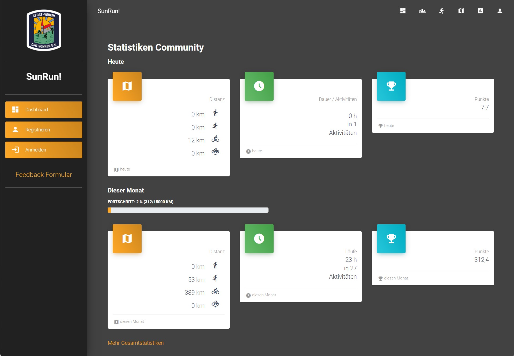 | 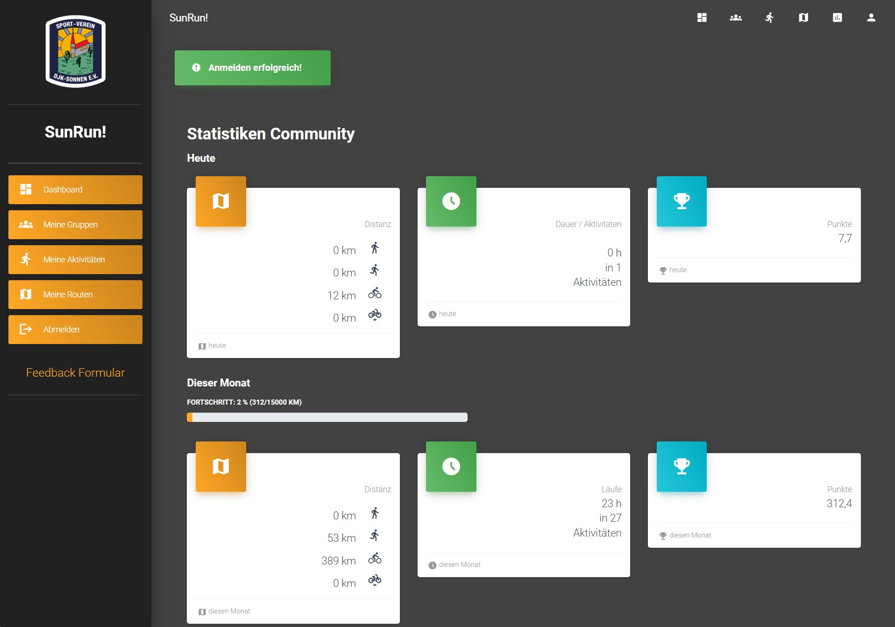


|  Log In  |  Sign Up  |  Profile  |
| :-------------------------: | :-------------------------: | :-------------------------: |
| 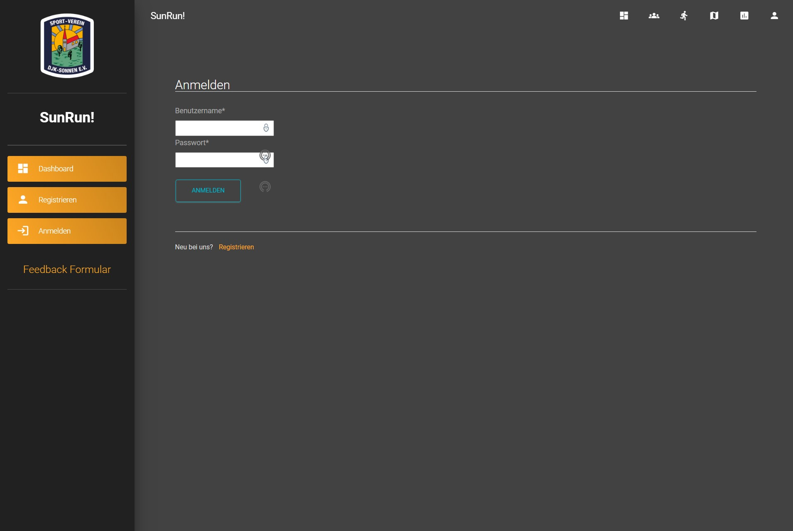 | 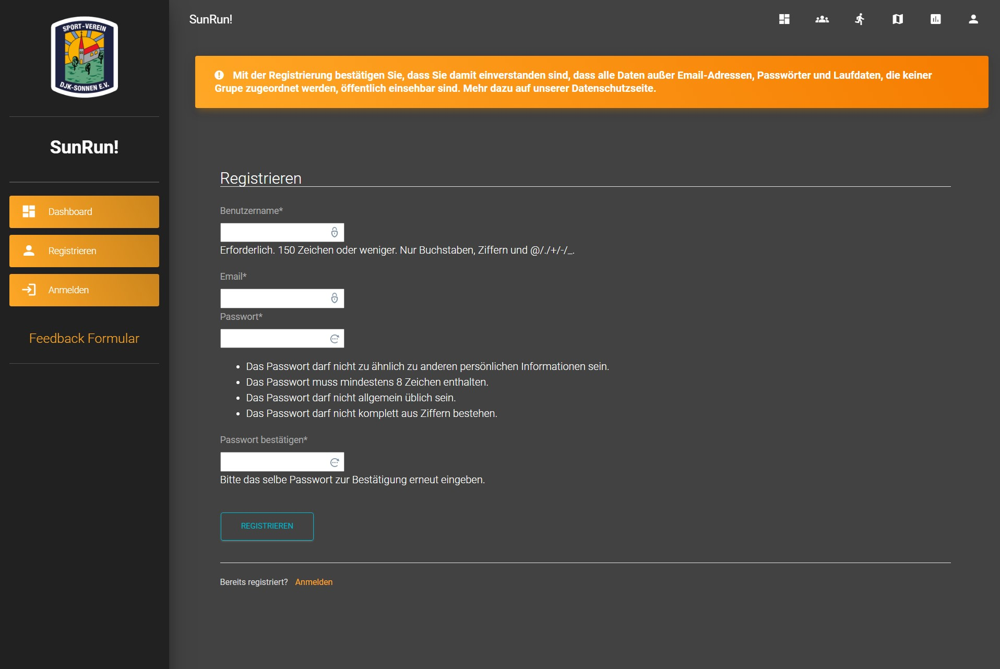 | 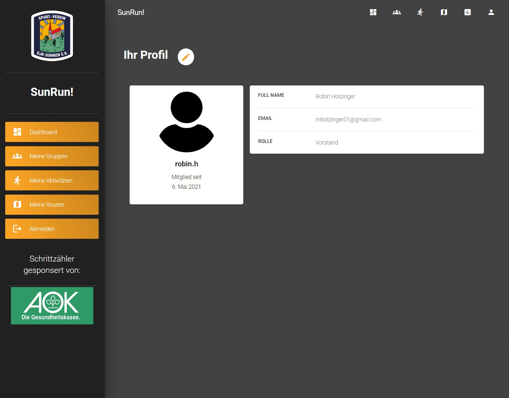

|  Route List  | Route Create  |
| :----------------------: | :-----------------------: |
| 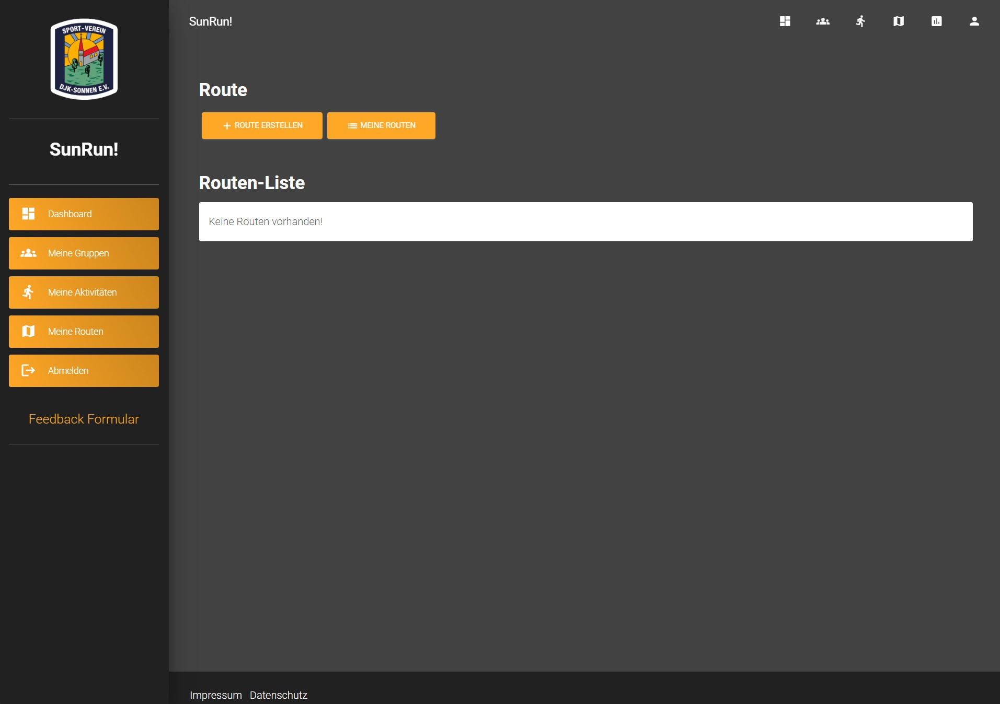 | 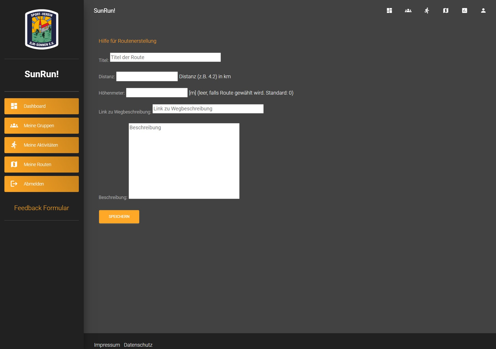

|  Activity List | Activity Create | Activity Detail  |
| :--------------------: | :--------------------: | :--------------------: |
 | 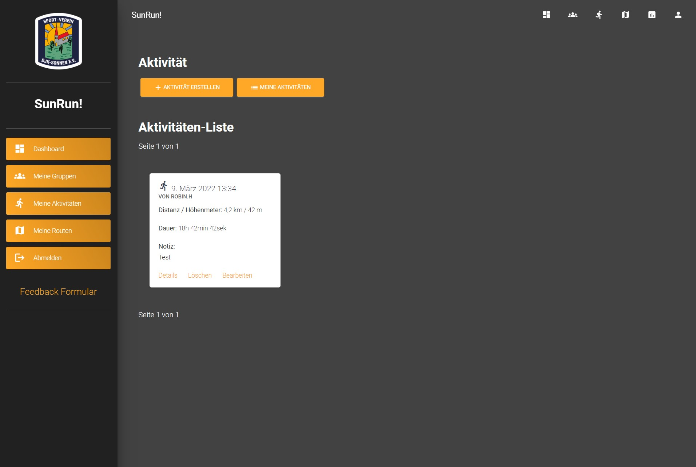 | 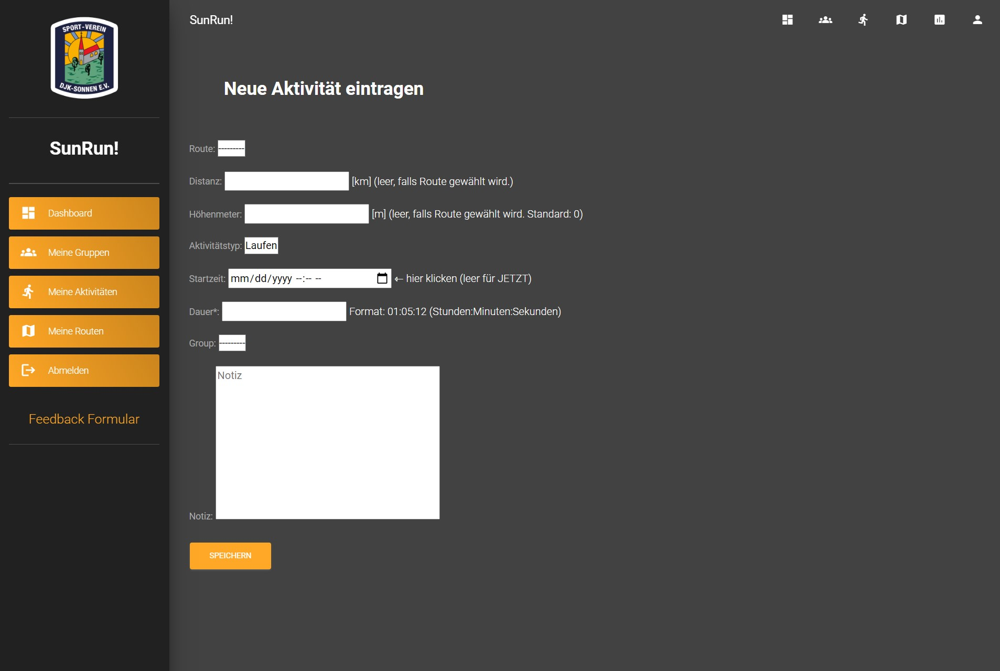 | 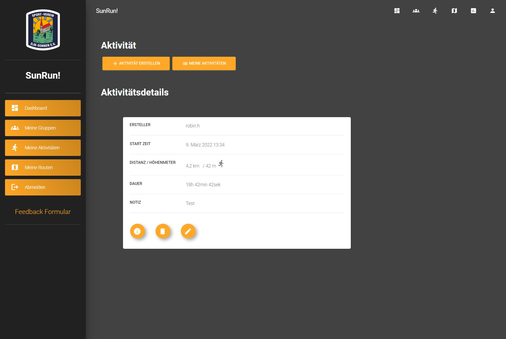

|  Group List  | Group Stats  |
| :----------------------: | :-----------------------: |
| 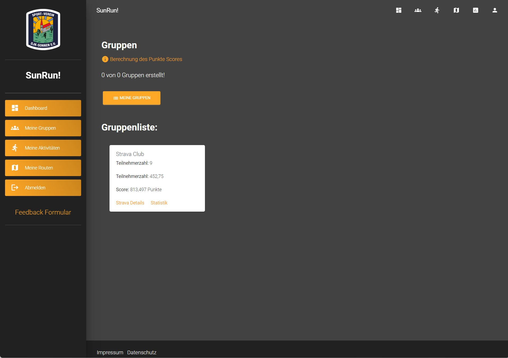 | 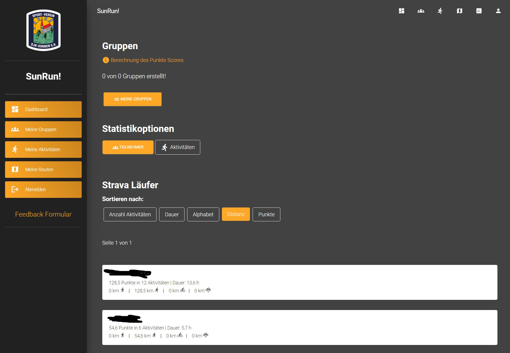

## Disclaimer
Note that this software is in an early stage of development and therefore is likely to have bugs.

## Installation
### 1. Python installation

### 2. Pip installation
- https://bootstrap.pypa.io/get-pip.py or _installation/get-pip.py
- Admin Shell: python _installation/get-pip.py

MacOS & Linux:
```
python3 -m pip install --user --upgrade pip
python3 -m pip --version
```

Windows:
```
py -m pip --version
// pip 9.0.1 from c:\python36\lib\site-packages (Python 3.6.1)
py -m pip install --upgrade pip
```

```
sudo apt install virtualenv
or
pip install virtualenv
or
py -m pip install --user virtualenv
```

### 3. Create virtual environment
maxOS & Linux
```
virtualenv --python=python3 env
or
python3 -m venv env
or 
apt-get install python3-venv
```

Windows:
```
py -m venv env
```

### 4. activating virtualenv
```
_scripts/_(_)?source.(sh|bat)
```
or
```
cd env/Scripts
Win: activate.bat
UNIX: source activate
```

### 5. Pip install requirements:
```
cd _installation
pip3 install -r requirements.txt
```

### 6. Setup Configurations:
```
_scripts/_(_)?setup.(sh|bat)
```

---
## ToDo's
1. Resetting passwords by email (setting up mail server)
2. setup scripts: create .config folder if not existing

---
